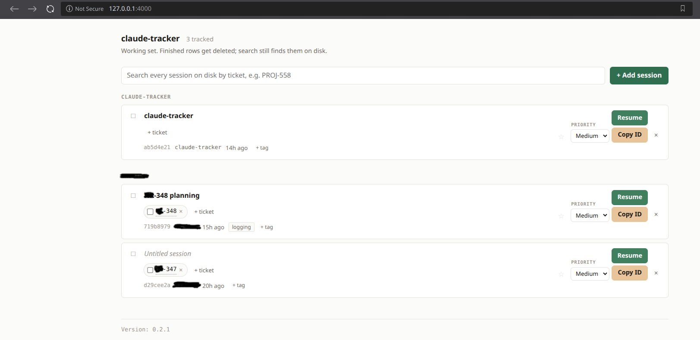

# claude-tracker

A local table of the Claude Code sessions you care about, cross-referenced to
Jira tickets. Replaces a notepad full of `claude --resume <uuid>` lines.

```bash
bun run server.ts     # http://127.0.0.1:4000
```

Two things are configured from the environment so no real value enters git:

```bash
export CT_JIRA_BASE="https://your-host.atlassian.net/browse"   # clickable tickets
export CT_TICKET_PREFIXES="ABC,XYZ"                            # defaults to NR
```

Without them the app still works; ticket keys just render as plain text and a
banner says so.

## What it does

- Reads `~/.claude/projects` and never writes to it. You never type a UUID.
- Resolves each session's Jira ticket and title from the transcript itself,
  preferring the `aiTitle` Claude Code already writes.
- Tracks the sessions you pick: tickets with per-ticket done state, Jira-style
  priority, a name, and tags.
- Resume opens a terminal running that session, falling back to the clipboard.
- Search covers every session on disk, not just the tracked ones, so deleting a
  row loses no history. It matches session ids, titles, ticket keys, and the
  body text of the transcript; a session that owns a ticket ranks above one that
  merely mentioned it, and body text ranks below both. Full-text hits show the
  matching phrase in context, which is how you find the sessions that never
  carried a ticket at all.
- Only what was said is indexed, not tool output or file dumps. That is 2% of
  the bytes on disk, and searching the other 98% finds the file rather than the
  session you were trying to remember.

<!-- Example layout - 2 projects -->



## Layout

| File                     | Job                                                  |
| ------------------------ | ---------------------------------------------------- |
| `scan.ts`                | Find sessions, resolve real project paths from `cwd` |
| `extract.ts`             | Transcript to ticket and name                        |
| `annotations.ts`         | The working set, atomic writes, serialised mutations |
| `server.ts`              | Routes, ticket index, guarded resume                 |
| `index.html`             | The UI                                               |
| `MANUAL-CHECKLIST.md`    | The UI test pass                                     |
| `TODOS.md`               | Deferred work, with reasons                          |
| `VERSION` / `version.ts` | Current version, semver parsing and bumping          |
| `release.ts`             | Cut a release: bump, changelog, commit, tag          |

State lives in `~/.claude-tracker/annotations.json` and is safe to hand-edit.

## Releasing

Write what changed under `## [Unreleased]` in `CHANGELOG.md` as you go, then:

```bash
bun run release.ts minor --dry   # show what would happen
bun run release.ts minor         # bump, changelog, commit, tag
```

It refuses to run on a dirty tree, on failing tests, with an empty Unreleased
section, or when the tag already exists. Each of those would record something
untrue. Semver here versions the `annotations.json` format and the HTTP surface:
major means a stored file stops loading, minor means new capability with old
files still working, patch means nothing observable changed.

```bash
bun test    # 144 tests, no dependencies
```
